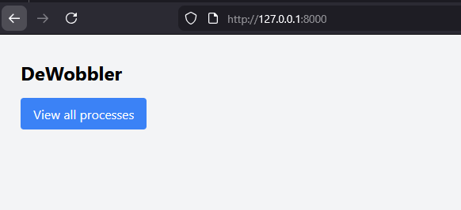
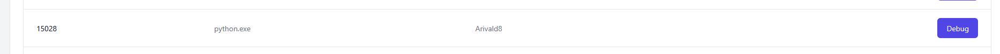
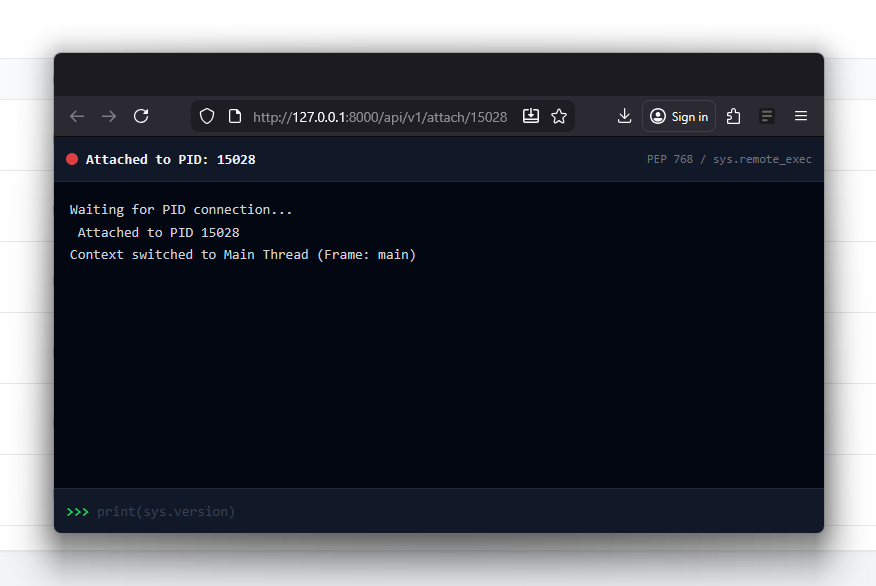
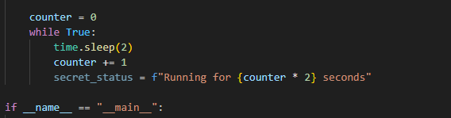
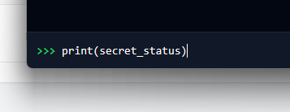
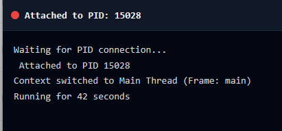

> _Dewobbler (n.): A tool designed to identify, correct, or eliminate instability, errors, or erratic behaviour ("wobbles") within a system._

# DeWobbler

DeWobbler is a very simple tool designed to explore the remote attachment capabilities introduced in Python 3.14.3 --> [Release Notes](https://www.python.org/downloads/release/python-3143/).

It's just a practical demonstration of PEP 768, specifically utilising the new sys.remote_exec function to inject code into a running Python process without terminating it.

Instead of using pdb directly, DeWobbler constructs a bridge between a web-based terminal and a target process to visualize the mechanics of code injection and state inspection.

## How It Works

The application functions using a reverse-connection architecture managed by a FastAPI backend. When a user attempts to attach to a process, the system performs the following steps:

The app opens a temporary TCP server on a random port to listen for incoming connections from the target.

A Python bootstrap script is generated and injected into the target process using sys.remote_exec. This function allows the interpreter to execute arbitrary code within the target's memory space.

The injected code runs inside the target process, locates the main thread, captures the current stack frame to access local variables, and connects back to the DeWobbler TCP server.

The backend bridges this TCP connection to a WebSocket in the browser. This creates a live REPL (Read-Eval-Print Loop) where the user can type commands in the web terminal and receive output from the remote process in real-time.

### Tech Stack

    Python 3.14.3+: Required for sys.remote_exec.

    FastAPI: Handles the HTTP serving and WebSocket management.

    HTMX: Powers the frontend interactivity and WebSocket connections without complex JavaScript frameworks.

    Tailwind CSS: Provides the styling for the web-based terminal interface.

    Other Deps: 
        pydantic-settings
        uvicorn[standard]
        jinja2
        psutil

### Limitations

The current implementation captures a snapshot of the target process's local variables by converting the FrameLocalsProxy to a standard dictionary. This allows you to read and inspect variables effectively. However, due to the nature of this snapshot, modifying a variable in the debugger console (e.g., x = 10) will not update the variable in the actual running process.

Additionally, as mentioned in [the offical docs for sys_remote_exec](https://docs.python.org/3/library/sys.html#sys.remote_exec), the target process MUST be running a CPython interpreter **of the same major AND minor version** as the local process

### Usage

Project relies on uv for dependency management and execution.

Ensure you have a **Python 3.14.3+** interpreter available on your system, both for the web server file and for your target process.

#### Installation

Clone the repository and install deps:

    uv sync

Start the web server:

    uv run uvicorn app.main:app --reload --port 8000

Start a dummy target process in a separate terminal (included as tester.py in test_process directory):

    uv run python tester.py

Navigate to http://127.0.0.1:8000/ in your browser and click on "View all processes":

Locate the target process in the list and click "Debug" to open the interactive session:

This will open a new browser window with a terminal session:

For example, we define tester.py with a secret_status var:

We can access it using the remote debugger:

Results in:

